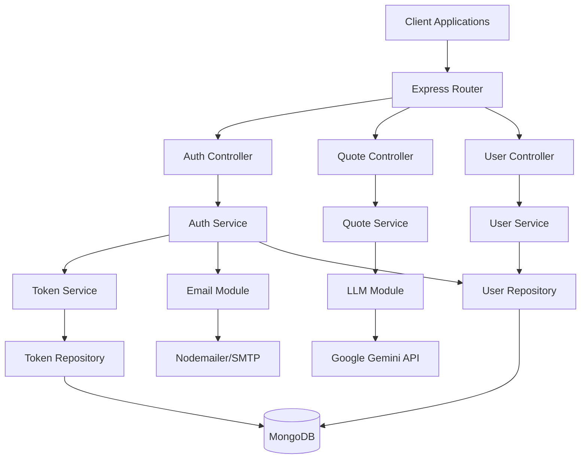

# Design Document: TypeScript Backend API

## Overview

This design outlines a modular TypeScript Express server with MongoDB integration, featuring comprehensive authentication, email services, and AI-powered quote generation. The architecture follows clean code principles with clear separation of concerns across controller, service, and DTO layers.

## Architecture

### High-Level Architecture



### Modular Structure

The application follows a layered architecture:

- **Controllers**: Handle HTTP requests/responses, input validation, and route logic
- **Services**: Contain business logic and coordinate between different modules
- **DTOs**: Define data transfer objects for request/response serialization
- **Repositories**: Handle database operations and data persistence
- **Modules**: Self-contained feature modules (Auth, Email, LLM)

## Components and Interfaces

### Core Modules

#### 1. Authentication Module
```typescript
interface IAuthService {
  register(userData: RegisterDto): Promise<AuthResponseDto>
  login(credentials: LoginDto): Promise<AuthResponseDto>
  refreshToken(refreshToken: string): Promise<TokenResponseDto>
  forgotPassword(email: string): Promise<void>
  resetPassword(token: string, newPassword: string): Promise<void>
  googleOAuth(code: string): Promise<AuthResponseDto>
}

interface ITokenService {
  generateTokens(userId: string): Promise<TokenPair>
  verifyAccessToken(token: string): Promise<JwtPayload>
  verifyRefreshToken(token: string): Promise<string>
  revokeRefreshToken(token: string): Promise<void>
}
```

#### 2. Email Module
```typescript
interface IEmailService {
  sendPasswordReset(email: string, resetToken: string): Promise<void>
  sendWelcomeEmail(email: string, name: string): Promise<void>
  sendEmail(options: EmailOptions): Promise<void>
}

interface EmailOptions {
  to: string
  subject: string
  html?: string
  text?: string
  template?: string
  templateData?: Record<string, any>
}
```

#### 3. LLM Module
```typescript
interface ILLMService {
  generateText(prompt: string, options?: GenerationOptions): Promise<string>
  generateQuote(theme?: string): Promise<QuoteDto>
}

interface GenerationOptions {
  maxTokens?: number
  temperature?: number
  topP?: number
}
```

#### 4. Quote Service
```typescript
interface IQuoteService {
  getRandomQuote(): Promise<QuoteDto>
  getQuoteByTheme(theme: string): Promise<QuoteDto>
  getCachedQuotes(): Promise<QuoteDto[]>
}
```

### Repository Interfaces

```typescript
interface IUserRepository {
  create(userData: CreateUserDto): Promise<User>
  findById(id: string): Promise<User | null>
  findByEmail(email: string): Promise<User | null>
  update(id: string, updateData: Partial<User>): Promise<User>
  delete(id: string): Promise<void>
}

interface ITokenRepository {
  saveRefreshToken(userId: string, token: string, expiresAt: Date): Promise<void>
  findRefreshToken(token: string): Promise<RefreshToken | null>
  revokeRefreshToken(token: string): Promise<void>
  revokeAllUserTokens(userId: string): Promise<void>
}
```

## Data Models

### User Entity
```typescript
interface User {
  _id: ObjectId
  email: string
  password?: string // Optional for OAuth users
  firstName: string
  lastName: string
  isEmailVerified: boolean
  googleId?: string
  profilePicture?: string
  createdAt: Date
  updatedAt: Date
  lastLoginAt?: Date
}
```

### Refresh Token Entity
```typescript
interface RefreshToken {
  _id: ObjectId
  userId: ObjectId
  token: string
  expiresAt: Date
  createdAt: Date
  isRevoked: boolean
}
```

### Quote Entity (for caching)
```typescript
interface Quote {
  _id: ObjectId
  text: string
  author?: string
  theme?: string
  source: 'gemini' | 'fallback'
  createdAt: Date
}
```

### DTOs (Data Transfer Objects)

#### Request DTOs
```typescript
interface RegisterDto {
  email: string
  password: string
  firstName: string
  lastName: string
}

interface LoginDto {
  email: string
  password: string
}

interface ForgotPasswordDto {
  email: string
}

interface ResetPasswordDto {
  token: string
  newPassword: string
}
```

#### Response DTOs
```typescript
interface AuthResponseDto {
  user: UserResponseDto
  tokens: TokenResponseDto
}

interface UserResponseDto {
  id: string
  email: string
  firstName: string
  lastName: string
  isEmailVerified: boolean
  profilePicture?: string
}

interface TokenResponseDto {
  accessToken: string
  refreshToken: string
  expiresIn: number
}

interface QuoteResponseDto {
  text: string
  author?: string
  theme?: string
}
```

## Correctness Properties

*A property is a characteristic or behavior that should hold true across all valid executions of a system-essentially, a formal statement about what the system should do. Properties serve as the bridge between human-readable specifications and machine-verifiable correctness guarantees.*

Now I'll analyze the acceptance criteria to determine which ones can be tested as properties:

### Property 1: User Registration Token Generation
*For any* valid user registration data, the Auth_System should create a User_Entity and return both access and refresh tokens
**Validates: Requirements 1.1**

### Property 2: Login Token Generation
*For any* valid user credentials, the Auth_System should authenticate the user and return both access and refresh tokens
**Validates: Requirements 1.2**

### Property 3: Access Token Authorization
*For any* valid access token, the Auth_System should grant access to protected endpoints
**Validates: Requirements 1.3**

### Property 4: Expired Token Rejection
*For any* expired access token, the Auth_System should reject requests and require token refresh
**Validates: Requirements 1.4**

### Property 5: Password Security
*For any* password, the Auth_System should hash it before storage and never store it in plain text
**Validates: Requirements 1.5**

### Property 6: JWT Access Token Format
*For any* token generation request, the Token_Service should create valid JWT access tokens with appropriate short expiration times
**Validates: Requirements 2.1**

### Property 7: Refresh Token Expiration
*For any* token generation request, refresh tokens should have longer expiration times than access tokens
**Validates: Requirements 2.2**

### Property 8: Token Refresh Generation
*For any* valid refresh token, the Token_Service should generate new access and refresh token pairs
**Validates: Requirements 2.3**

### Property 9: Refresh Token Invalidation
*For any* refresh token usage, the old refresh token should become invalid after generating new tokens
**Validates: Requirements 2.4**

### Property 10: Refresh Token Storage
*For any* generated refresh token, it should be securely stored in the database
**Validates: Requirements 2.5**

### Property 11: OAuth User Data Processing
*For any* valid Google user data, the Auth_System should create or update the corresponding User_Entity
**Validates: Requirements 3.3**

### Property 12: OAuth Token Generation
*For any* successful Google OAuth flow, the Auth_System should return access and refresh tokens
**Validates: Requirements 3.4**

### Property 13: OAuth Error Handling
*For any* OAuth error condition, the Auth_System should handle it gracefully and provide meaningful error messages
**Validates: Requirements 3.5**

### Property 14: Profile Data Retrieval
*For any* authenticated user, requesting profile data should return current user information
**Validates: Requirements 4.1**

### Property 15: Password Reset Token Generation
*For any* password reset request, the Auth_System should generate a secure reset token
**Validates: Requirements 4.2**

### Property 16: Password Reset Update
*For any* valid reset token and new password, the Auth_System should update the user's password
**Validates: Requirements 4.3**

### Property 17: Password Strength Validation
*For any* password input, the Auth_System should validate it according to security requirements
**Validates: Requirements 4.4**

### Property 18: Password Reset Email
*For any* password reset request, the Email_Module should send reset instructions to the user's email
**Validates: Requirements 4.5**

### Property 19: Email Format Support
*For any* email content, the Email_Module should support both HTML and plain text formats
**Validates: Requirements 5.2**

### Property 20: Email Error Handling
*For any* email sending failure, the Email_Module should log errors and provide fallback mechanisms
**Validates: Requirements 5.3**

### Property 21: Email Template Support
*For any* template data, the Email_Module should support email templates for consistent formatting
**Validates: Requirements 5.4**

### Property 22: Email Address Validation
*For any* email address input, the Email_Module should validate it before sending
**Validates: Requirements 5.5**

### Property 23: Quote Generation
*For any* quote request, the Quote_Service should generate a random inspirational quote
**Validates: Requirements 6.1**

### Property 24: Quote Fallback Mechanism
*For any* external API failure, the Quote_Service should provide fallback quotes
**Validates: Requirements 6.3**

### Property 25: Quote Caching
*For any* generated quote, the Quote_Service should cache it to improve performance
**Validates: Requirements 6.4**

### Property 26: Quote Content Validation
*For any* generated content, the Quote_Service should validate and sanitize it before returning
**Validates: Requirements 6.5**

### Property 27: LLM Retry Logic
*For any* LLM API request failure, the LLM_Module should implement retry logic with exponential backoff
**Validates: Requirements 7.3**

### Property 28: LLM Rate Limiting
*For any* rate limiting scenario, the LLM_Module should handle rate limits and quota management appropriately
**Validates: Requirements 7.4**

### Property 29: LLM Input/Output Validation
*For any* LLM inputs and outputs, the LLM_Module should validate and sanitize them
**Validates: Requirements 7.5**

### Property 30: Error Handling and Logging
*For any* error condition across all modules, the API_Server should provide clear error handling and logging
**Validates: Requirements 8.5**

### Property 31: Database Error Messages
*For any* database operation failure, the Database_Layer should provide meaningful error messages
**Validates: Requirements 9.3**

### Property 32: Database Connection Management
*For any* database connection scenario, the Database_Layer should implement proper connection pooling and retry logic
**Validates: Requirements 9.4**

### Property 33: Data Schema Validation
*For any* data before persistence, the Database_Layer should validate it against the schema
**Validates: Requirements 9.5**

### Property 34: Input Data Validation
*For any* request data, the API_Server should validate it using DTOs
**Validates: Requirements 10.2**

### Property 35: Response Format Consistency
*For any* API response, the API_Server should use consistent response formats
**Validates: Requirements 10.3**

### Property 36: HTTP Status Code Appropriateness
*For any* API scenario, the API_Server should implement proper HTTP status codes
**Validates: Requirements 10.4**

### Property 37: Comprehensive Error Messages
*For any* error condition, the API_Server should provide comprehensive error messages with appropriate detail levels
**Validates: Requirements 10.5**

### Property 38: Sensitive Data Exclusion
*For any* user data response, the API_Server should exclude sensitive fields like passwords and internal IDs
**Validates: Requirements 11.1**

### Property 39: Endpoint-Relevant Fields
*For any* response serialization, the API_Server should only include fields relevant to the specific endpoint
**Validates: Requirements 11.2**

### Property 40: Context-Based Field Customization
*For any* entity returned by different endpoints, the API_Server should customize fields based on the context
**Validates: Requirements 11.4**

### Property 41: Field Naming Consistency
*For any* API response, the API_Server should maintain consistent field naming conventions
**Validates: Requirements 11.5**

## Error Handling

### Error Response Format
All API errors follow a consistent format:
```typescript
interface ErrorResponse {
  success: false
  error: {
    code: string
    message: string
    details?: any
    timestamp: string
    path: string
  }
}
```

### Error Categories
1. **Validation Errors** (400): Invalid input data, DTO validation failures
2. **Authentication Errors** (401): Invalid credentials, expired tokens
3. **Authorization Errors** (403): Insufficient permissions
4. **Not Found Errors** (404): Resource not found
5. **Conflict Errors** (409): Duplicate resources, business rule violations
6. **Server Errors** (500): Database failures, external API failures
7. **Service Unavailable** (503): External service failures with fallback

### Error Handling Strategy
- All errors are logged with appropriate detail levels
- Sensitive information is never exposed in error messages
- External API failures trigger fallback mechanisms
- Database connection issues implement retry logic
- Rate limiting errors provide retry-after headers

## Testing Strategy

### Dual Testing Approach
The system requires both unit testing and property-based testing for comprehensive coverage:

**Unit Tests**:
- Test specific examples and edge cases
- Verify integration points between modules
- Test error conditions and boundary values
- Focus on concrete scenarios and expected behaviors

**Property-Based Tests**:
- Verify universal properties across all inputs
- Test system behavior with randomized data
- Validate correctness properties from the design document
- Ensure comprehensive input coverage through randomization

### Property-Based Testing Configuration
- **Framework**: fast-check for TypeScript property-based testing
- **Minimum iterations**: 100 per property test
- **Test tagging**: Each property test references its design document property
- **Tag format**: `Feature: typescript-backend-api, Property {number}: {property_text}`

### Testing Coverage Requirements
- Each correctness property must be implemented by a single property-based test
- Unit tests complement property tests by covering specific examples
- Integration tests verify end-to-end workflows
- Mock external dependencies (Gemini API, email services) for reliable testing

### Test Organization
```
tests/
├── unit/
│   ├── auth/
│   ├── email/
│   ├── llm/
│   └── quote/
├── property/
│   ├── auth.property.test.ts
│   ├── email.property.test.ts
│   ├── llm.property.test.ts
│   └── quote.property.test.ts
└── integration/
    ├── auth-flow.test.ts
    └── api-endpoints.test.ts
```

### Mock Strategy
- Mock external APIs (Gemini, Google OAuth) for consistent testing
- Use in-memory MongoDB for database testing
- Mock email sending for testing email functionality
- Provide fallback data for external service failures